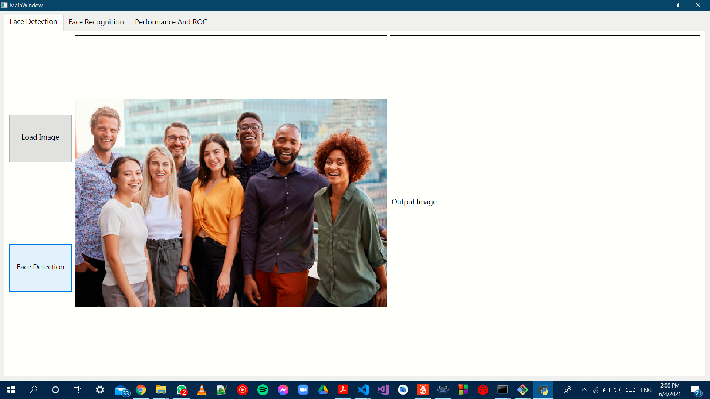

# cv404-2021-final-project-sbe404b-team06

# First Time To Run

## Unzip the AT&T then run OneTime.py to divide The Data to train and test 

# Point 1 Face Detection 

## GUI

## Loading Image

## Face Detected

# Point 2 Face Recognition

## GUI

## Load Training Data

## Loading Test Data and Enter the Threshold Value

## Result of matching

## Another Test

# Point 3 Performance Report

## ROC Curve And Accuracy
