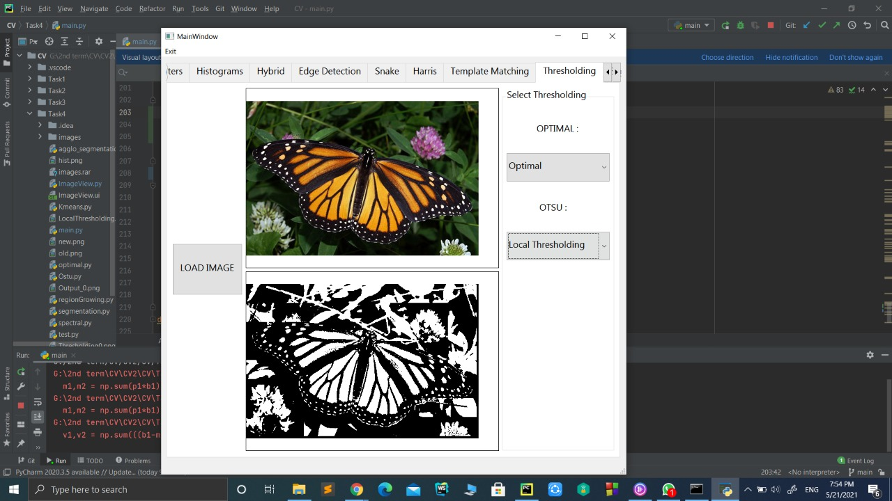

# cv404_2021_project-4-sbe404b-team06

# Point 1 

## Ostu Global Thresholding

## Ostu Local Thresholding

## Optimal Global Thresholding

## Optimal Local Thresholding

## Spectral Thresholding

# Point 2

## K-Mean Segmentation

## Region Aggromerative Segmentation

## Region Growing Segmentation

## Mean Shift Segmentation

## notes
to apply region growing :
1. load the image
2. click region growing
3. click choose seeds
4. click on the image to choose more than one seed
5. click apply
